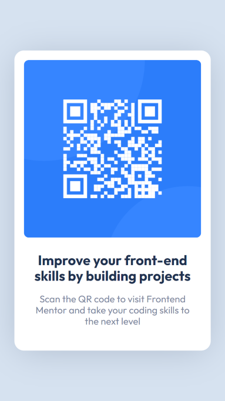
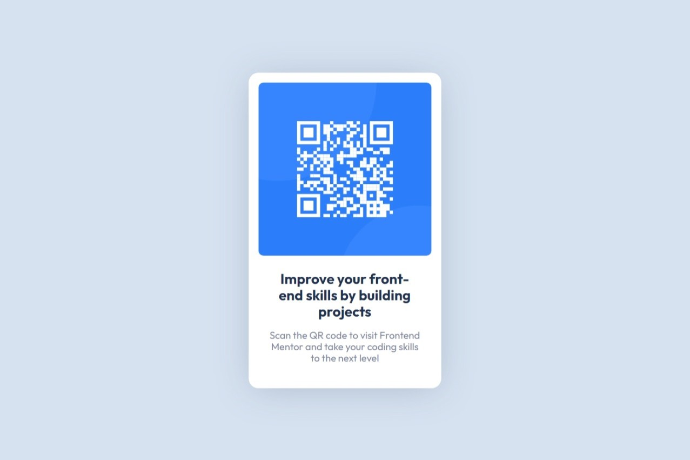

# Frontend Mentor - QR code component solution

This is a solution to the [QR code component challenge on Frontend Mentor](https://www.frontendmentor.io/challenges/qr-code-component-iux_sIO_H).

## Table of contents

- [Overview](#overview)
  - [Screenshot](#screenshot)
  - [Links](#links)
- [My process](#my-process)
  - [Built with](#built-with)
  - [What I learned](#what-i-learned)
  - [Continued development](#continued-development)
  - [Useful resources](#useful-resources)
- [Author](#author)
- [Acknowledgments](#acknowledgments)

**Note: Delete this note and update the table of contents based on what sections you keep.**

## Overview

### Screenshots

| Mobile                          | Desktop                            |
| ------------------------------- | ---------------------------------- |
|  |  |

### Links

- Live Site: [Add live site URL here](https://your-live-site-url.com)

## My process

### Built with

- Semantic HTML5 markup
- CSS custom properties
- Flexbox
- Mobile-first workflow
- [React](https://reactjs.org/)

### What I learned

This challenge was a way to learn some basic React concepts, as well as a primary structuring of the components. In the side of styling, more than a learning experience, was a reinforcement of the basic knowledge I acquired as a frontend developer. This is so that I don't forget them and keep looking for ways to innovate.

For the styles, I have followed some guidelines from [ITCSS](https://www.xfive.co/blog/itcss-scalable-maintainable-css-architecture/) so that I can better organize the proposed design.

Thus, the main CSS file looks like this:

```css
@import url("./styles/-generic.css");
@import url("./styles/-elements.css");
@import url("./styles/-components.css");
```
I think it's a nice, clean way to organize styling. It may be overwhelming for small projects, but for large ones it might be helpulf.

## Author

- Frontend Mentor - [@sebas-tcotd](https://www.frontendmentor.io/profile/sebas-tcotd)
- Twitter - [@sebas_tcotd](https://twitter.com/sebas_tcotd)

---
<br />
<div style="text-align: center; font-family: monospace; font-size: 10px">||S||</div>
